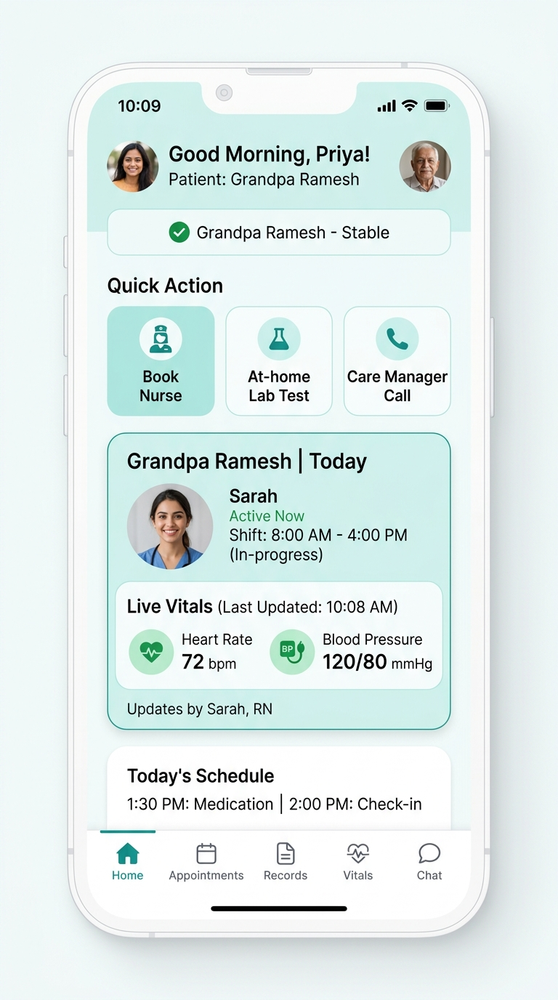
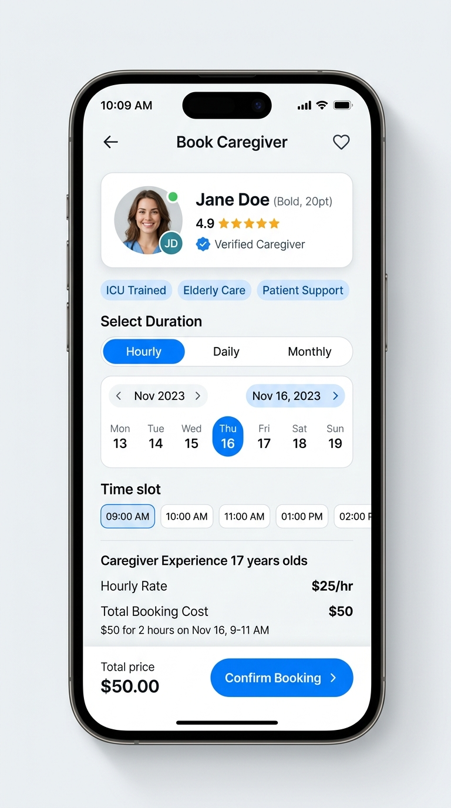
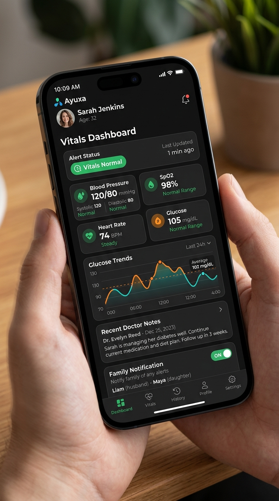
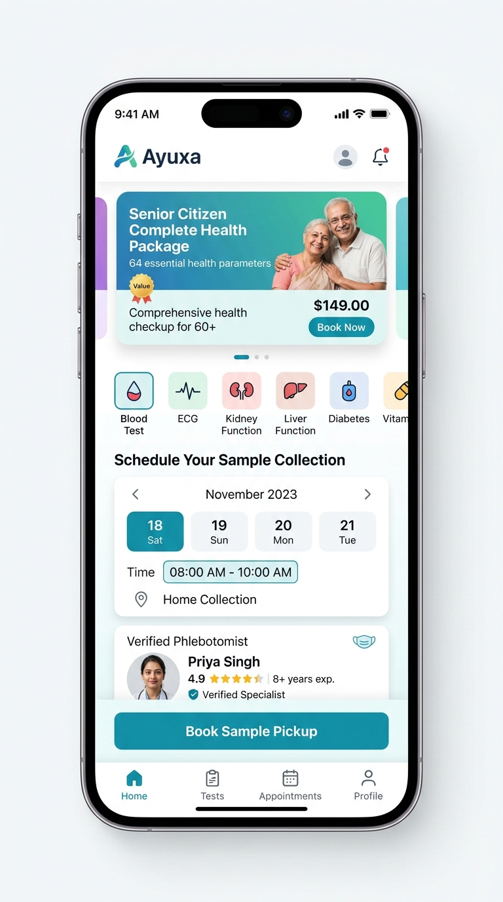
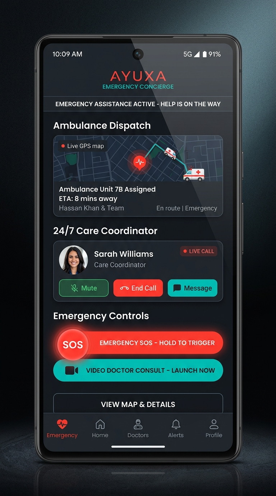

# Ayuxa Patient & Family — 5-Screen Figma UI Redesign

A modern, accessibility-first mobile UI redesign for **Ayuxa Patient & Family** (`com.ayuxa.ayuxa_patient_family`), featuring 5 complete user flow screens, design system tokens, SVG vector kits for Figma, and a live interactive prototype.

---

## 🎨 5 Showcase Mobile Screens

  
  
  
  
  

---

## 🚀 Live Demo & Figma Files

* **Live Interactive Web Prototype**: Open `index.html` or view on GitHub Pages.
* **Master Figma Vector Board**: [`Ayuxa_5_Screens_Figma_UI_Kit.svg`](Ayuxa_5_Screens_Figma_UI_Kit.svg) (Drag & drop directly into Figma canvas).
* **Figma Design Tokens**: [`figma_tokens.json`](figma_tokens.json).

---

## 📱 Screen Descriptions

1. **Home Family Dashboard**: Live health status banner ("Vitals are Stable"), active caregiver shift card (Sarah RN), 1-tap quick action cards with high-contrast icons, 24/7 floating SOS button.
2. **Book Verified Caregiver**: Category filter tabs (Home Nurse, Attendant, Physio), caregiver profile cards with verified badges, hourly/daily pricing (`₹800 / 12 hr`), experience badges.
3. **Vitals Tracker (Dark Mode)**: OLED dark theme with metrics for Blood Pressure, SpO2, Heart Rate, Blood Glucose, and 24-hour SVG trend line graph.
4. **At-Home Labs & Diagnostics**: Senior Citizen Complete Checkup promo banner (64 parameters), sample collection scheduling calendar, verified phlebotomist profile.
5. **24/7 Emergency Dispatch & Doctor Video Consult**: Active emergency dispatch alert, ambulance live ETA tracking (`8 mins away`), 24/7 Ayuxa care coordinator hotline, instant video doctor launcher.

---

## 🛠️ How to Import into Figma

1. Open **Figma** ([figma.com](https://figma.com)).
2. Drag and drop `Ayuxa_5_Screens_Figma_UI_Kit.svg` into your Figma canvas.
3. Figma automatically converts all vector elements into editable Figma Frames, Text Layers, and Shapes.
